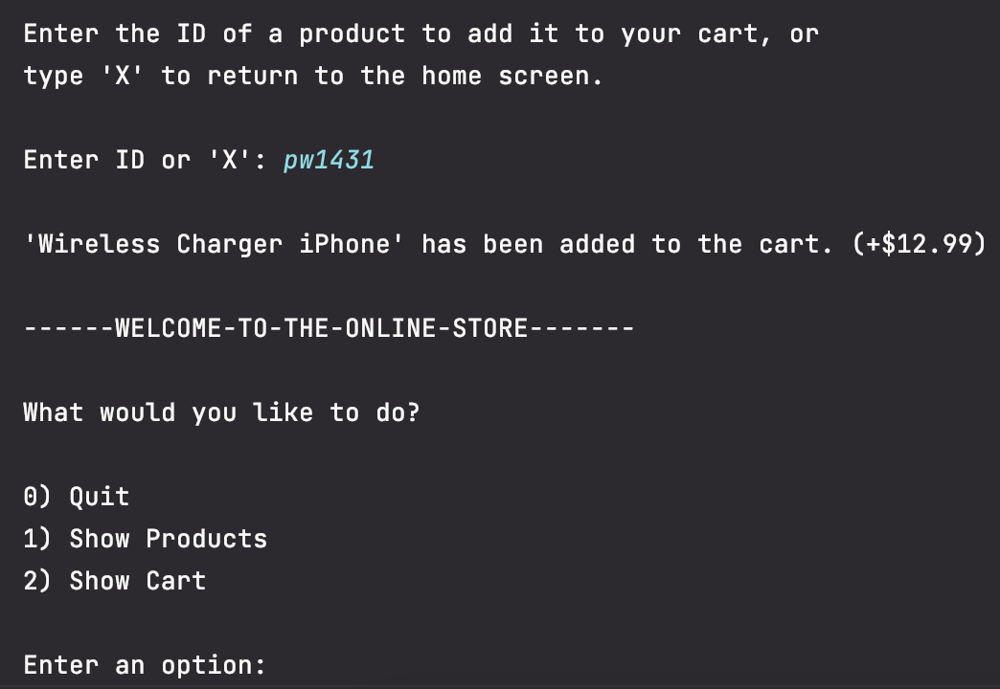

# OnlineStore

This application allows you to browse & check out products in an online store.

Users have the ability to:
1. List all products in the store
2. List all products currently in the cart
3. Add items to the cart
4. Remove items from the cart
5. Empty the cart
6. Checkout after they're done shopping

## Home Screen
On the Home screen, users can choose to either show products or show their shopping cart by entering 1 or 2 respectively.

NOTE: Entering an invalid option will NOT crash the program.

## Show Products
On the Show Products screen, users will be provided a full list of available products along with their IDs, Names, and Prices.
They will then be prompted to add a product to their cart by ID or return to the Home screen.

NOTE: Entering an invalid ID will NOT crash the program.

## Show Cart
On the Show Cart screen, all items in the cart will be displayed with their name and quantity.
Users will then be prompted to do one of the following: 

1. Check out
2. Remove an item
3. Empty the cart
4. Return to home screen

## Adding Items to the Cart
After entering a valid ID, a message will be displayed to confirm that the item has been added to the cart. This message will include the name of the item, as well as the price.
The user will then be returned to the Home screen.

NOTE: When entering an ID, it is NOT case-sensitive

## Removing Items from the Cart
After entering a valid item name, the item will be removed from the cart and the price of the item will be removed from the total.

This will only remove items one by one, so if you have more than 1 of the item, you will have to repeat this process.

NOTE: The item name must be entered EXACTLY how it appears in the cart.

## Emptying the Cart
When emptying the cart, users will be asked to confirm that they want to do so.
If they answer yes, the cart will be wiped and a confirmation message will be displayed.

## Checking Out
When users are ready to check out, they will be presented with their total and be prompted to enter an amount of money to pay with.

After a valid payment amount is entered, users will be provided a confirmation that lists the items they bought, as well as their change due.

The total is then reset to $0.00 and the cart is wiped of all items.

## Insufficient Funds
If an insufficient payment amount is entered, users will be notified that their payment has been returned.

